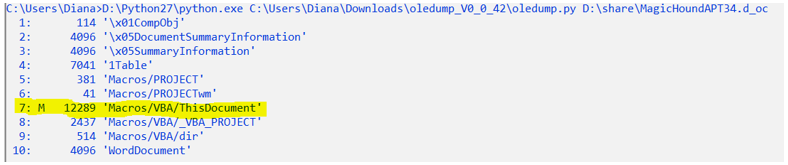

# APT34
Research files  magichoundapt34.doc and  OilRigThreeDollars.bin
## magichoundapt34.doc
This file. doc is stored in the OLEGF file format. The oledump utility is a tool written in Python that allows you to extract various streams contained in an olecf file.

The 7th thread uses macros. Export this thread:

This macro calls a base64 encoded PowerShell script. Using the online service: <https://gchq.github.io/CyberChef/> the received script was decoded.

The $ G8t variable contains some additional PowerShell code.
At the end of the file, the same Powershell code is again encoded in base64 and then executed using the 32-bit version of PowerShell (powershell.exe is located in the subfolder syswow64).
A very common reason for using 32-bit binaries is when an attacker has a 32-bit shell code they want to execute. 
The variable $ z is an array of byte values. The attacker uses the MemSet function to write shellcode byte-by-byte to the memory allocated to him by VirtualAlloc. The $ g variable specifies a record of 1000 bytes.
From the shell code in the variable $z, create a binary file. The resulting file is not a complete binary file, so the scDbg tool was used to run it.

MagicHoundapt34.doc uses vbs scripts to execute. This file is a test loader because the local IP address is called via port 5555.
## OilRigThreeDollars.bin
Oledump:

The 8th thread uses macros. Export this thread:
<Ссылка>

